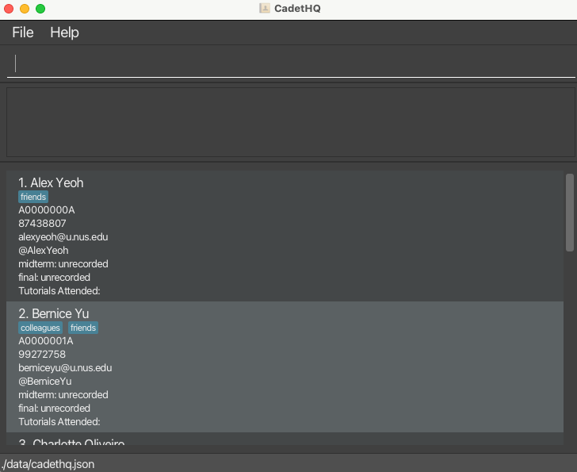

CadetHQ is a **desktop app designed for CS1101S teaching assistants, optimized for use via a Command Line Interface** (CLI) while still maintaining the benefits of a Graphical User Interface (GUI).

It is named CadetHQ as it is designed to assist CS1101S teaching assistants with administrative management for their CS1101S tutees in NUS's educational platform [Source Academy](https://sourceacademy.nus.edu.sg/).

For a detailed documentation of this project, please view the [CadetHQ Product Website](https://ay2526s1-cs2103t-t11-2.github.io/tp/).

This project is based on the AddressBook-Level3 project created by the [SE-EDU initiative](https://se-education.org).
