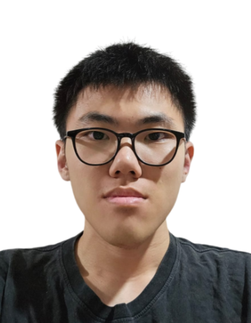
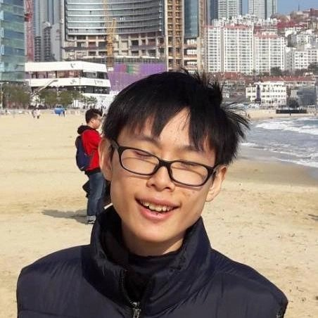
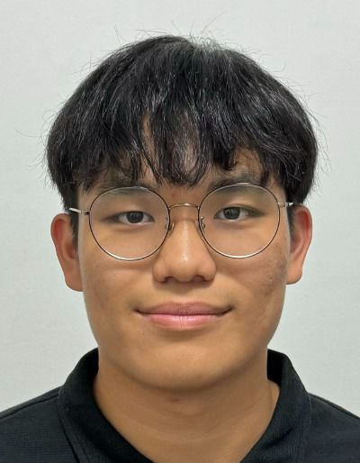

We are a team based in the [School of Computing, National University of Singapore](https://www.comp.nus.edu.sg).

You can reach us at the email `seer[at]comp.nus.edu.sg`

## Project team

### Yeo Yong Xuan

[[github](https://github.com/yoyongxuan)]
[[portfolio](team/johndoe.md)]

* Role: Developer

### Rae Yen

[[github](https://github.com/meltedham)]
[[portfolio](team/meltedham.md)]

* Role: Developer
* Responsibilities: Deliverables, Testing, Documentation

### De Heng

[[github](https://github.com/ndhhh)]
[[portfolio](team/ndhhh.md)]

* Role: Developer

### Jotham Wong

[[github](http://github.com/jothamwong)]
[[portfolio](team/jothamwong.md)]

* Role: Developer
* Responsibilities: UI

### Jeremy Ang

[[github](http://github.com/jeremy-a-0808)]
[[portfolio](team/jeremy-a-0808.md)]

* Role: Developer
* Responsibilities: UI

