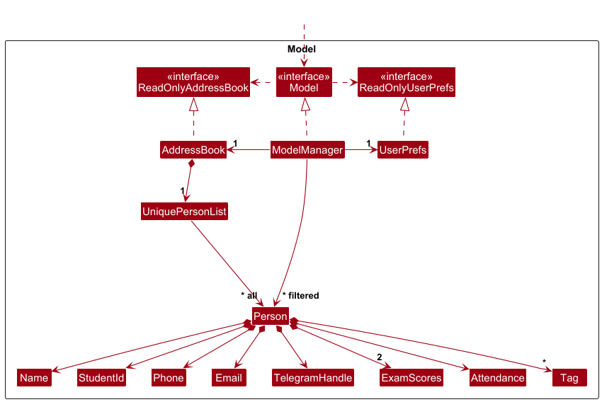
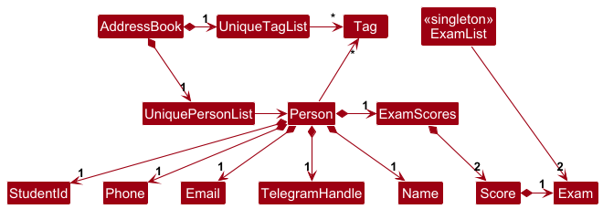
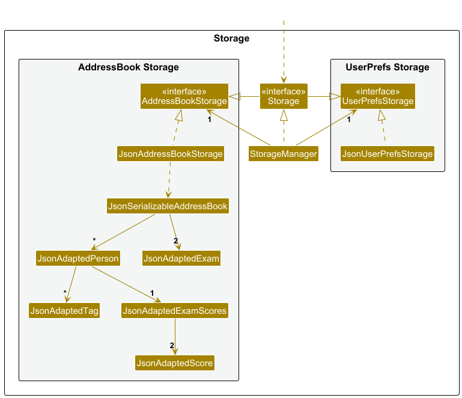
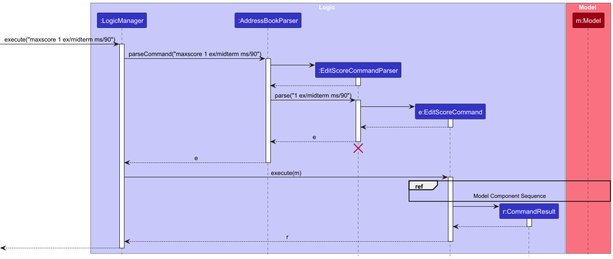
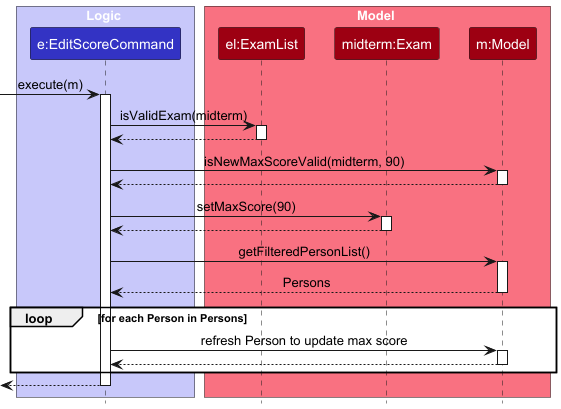

* Table of Contents
{:toc}

--------------------------------------------------------------------------------------------------------------------

## **Acknowledgements**

* This project is based on the AddressBook-Level3 project created by the [SE-EDU initiative](https://se-education.org).
* The automated GUI tests using TestFX was adapted from the AddressBook-Level4 project by the same creator

--------------------------------------------------------------------------------------------------------------------

## **Setting up, getting started**

Refer to the guide [_Setting up and getting started_](SettingUp.md).

--------------------------------------------------------------------------------------------------------------------

## **Design**

:bulb: **Tip:** The `.puml` files used to create diagrams are in this document `docs/diagrams` folder. Refer to the [_PlantUML Tutorial_ at se-edu/guides](https://se-education.org/guides/tutorials/plantUml.html) to learn how to create and edit diagrams.

### Architecture

The ***Architecture Diagram*** given above explains the high-level design of the App.

Given below is a quick overview of main components and how they interact with each other.

**Main components of the architecture**

**`Main`** (consisting of classes [`Main`](https://github.com/AY2526S1-CS2103T-T11-2/tp/blob/master/src/main/java/seedu/address/Main.java) and [`MainApp`](https://github.com/AY2526S1-CS2103T-T11-2/tp/blob/master/src/main/java/seedu/address/MainApp.java)) is in charge of the app launch and shut down.
* At app launch, it initializes the other components in the correct sequence, and connects them up with each other.
* At shut down, it shuts down the other components and invokes cleanup methods where necessary.

The bulk of the app's work is done by the following four components:

* [**`UI`**](#ui-component): The UI of the App.
* [**`Logic`**](#logic-component): The command executor.
* [**`Model`**](#model-component): Holds the data of the App in memory.
* [**`Storage`**](#storage-component): Reads data from, and writes data to, the hard disk.

[**`Commons`**](#common-classes) represents a collection of classes used by multiple other components.

**How the architecture components interact with each other**

The *Sequence Diagram* below shows how the components interact with each other for the scenario where the user issues the command `delete 1`.

Each of the four main components (also shown in the diagram above),

* defines its *API* in an `interface` with the same name as the Component.
* implements its functionality using a concrete `{Component Name}Manager` class (which follows the corresponding API `interface` mentioned in the previous point.

For example, the `Logic` component defines its API in the `Logic.java` interface and implements its functionality using the `LogicManager.java` class which follows the `Logic` interface. Other components interact with a given component through its interface rather than the concrete class (reason: to prevent outside component's being coupled to the implementation of a component), as illustrated in the (partial) class diagram below.

The sections below give more details of each component.

### UI component

The **API** of this component is specified in [`Ui.java`](https://github.com/AY2526S1-CS2103T-T11-2/tp/blob/master/src/main/java/seedu/address/ui/Ui.java)

The UI consists of a `MainWindow` that is made up of parts e.g.`CommandBox`, `ResultDisplay`, `PersonListPanel`, `StatusBarFooter` etc. All these, including the `MainWindow`, inherit from the abstract `UiPart` class which captures the commonalities between classes that represent parts of the visible GUI.

The `UI` component uses the JavaFx UI framework. The layout of these UI parts are defined in matching `.fxml` files that are in the `src/main/resources/view` folder. For example, the layout of the [`MainWindow`](https://github.com/AY2526S1-CS2103T-T11-2/tp/blob/master/src/main/java/seedu/address/ui/MainWindow.java) is specified in [`MainWindow.fxml`](https://github.com/AY2526S1-CS2103T-T11-2/tp/blob/master/src/main/resources/view/MainWindow.fxml)

The `UI` component,

* executes user commands using the `Logic` component.
* listens for changes to `Model` data so that the UI can be updated with the modified data.
* keeps a reference to the `Logic` component, because the `UI` relies on the `Logic` to execute commands.
* depends on some classes in the `Model` component, as it displays `Person` object residing in the `Model`.

### Logic component

**API** : [`Logic.java`](https://github.com/AY2526S1-CS2103T-T11-2/tp/blob/master/src/main/java/seedu/address/logic/Logic.java)

Here's a (partial) class diagram of the `Logic` component:

The sequence diagram below illustrates the interactions within the `Logic` component, taking `execute("delete 1")` API call as an example.

:information_source: **Note:** The lifeline for `DeleteCommandParser` should end at the destroy marker (X) but due to a limitation of PlantUML, the lifeline continues till the end of diagram.

How the `Logic` component works:

1. When `Logic` is called upon to execute a command, it is passed to an `AddressBookParser` object which in turn creates a parser that matches the command (e.g., `DeleteCommandParser`) and uses it to parse the command.
1. This results in a `Command` object (more precisely, an object of one of its subclasses e.g., `DeleteCommand`) which is executed by the `LogicManager`.
1. The command can communicate with the `Model` when it is executed (e.g. to delete a person). 
   Note that although this is shown as a single step in the diagram above (for simplicity), in the code it can take several interactions (between the command object and the `Model`) to achieve.
1. The result of the command execution is encapsulated as a `CommandResult` object which is returned back from `Logic`.

Here are the other classes in `Logic` (omitted from the class diagram above) that are used for parsing a user command:

How the parsing works:
* When called upon to parse a user command, the `AddressBookParser` class creates an `XYZCommandParser` (`XYZ` is a placeholder for the specific command name e.g., `AddCommandParser`) which uses the other classes shown above to parse the user command and create a `XYZCommand` object (e.g., `AddCommand`) which the `AddressBookParser` returns back as a `Command` object.
* All `XYZCommandParser` classes (e.g., `AddCommandParser`, `DeleteCommandParser`, ...) inherit from the `Parser` interface so that they can be treated similarly where possible e.g, during testing.

### Model component
**API** : [`Model.java`](https://github.com/AY2526S1-CS2103T-T11-2/tp/blob/master/src/main/java/seedu/address/model/Model.java)

The `Model` component,

* stores the Address Book data i.e., all `Person` objects (which are contained in a `UniquePersonList` object).
* stores the currently 'selected' `Person` objects (e.g., results of a search query) as a separate _filtered_ list which is exposed to outsiders as an unmodifiable `ObservableList<Person>` that can be 'observed' e.g. the UI can be bound to this list so that the UI automatically updates when the data in the list change.
* stores a `UserPref` object that represents the user’s preferences. This is exposed to the outside as a `ReadOnlyUserPref` objects.
* does not depend on any of the other three components (as the `Model` represents data entities of the domain, they should make sense on their own without depending on other components)

:information_source: **Note:** An alternative (arguably, a more OOP) model is given below. It has a `Tag` list in the `AddressBook`, which `Person` references. This allows `AddressBook` to only require one `Tag` object per unique tag, instead of each `Person` needing their own `Tag` objects. 

### Storage component

**API** : [`Storage.java`](https://github.com/AY2526S1-CS2103T-T11-2/tp/blob/master/src/main/java/seedu/address/storage/Storage.java)

The `Storage` component,
* can save both Address Book data and user preference data in JSON format, and read them back into corresponding objects.
* inherits from both `AddressBookStorage` and `UserPrefStorage`, which means it can be treated as either one (if only the functionality of only one is needed).
* depends on some classes in the `Model` component (because the `Storage` component's job is to save/retrieve objects that belong to the `Model`)

Persistent data is stored as local JSON files, located in the same folder where the JAR file for CadetHQ is ran. The following JSON files are created:

- `preferences.json`
- `config.json`
- `data/cadethq.json`

[Jackson](https://github.com/FasterXML/jackson) is used for JSON (de)serialization and relies on adapted models via the [Data Transfer Object pattern](https://www.baeldung.com/java-dto-pattern).

#### Malformed JSONs

If a JSON file is malformed, the contents will not be loaded and a log message will be printed. A malformed JSON file includes files that have invalid JSON syntax or files that are missing crucial user data.

No proactive measures are taken to rectify the issue, such as deleting the file or fixing the error. This decision was made to avoid prescribing a fixed approach to resolving malformed JSON files. Instead, we simply load sensible defaults, such as an empty Address Book when the user loads the application, and overwrite the malformed JSON file when the user inputs data.

For `data/cadethq.json`, this occurs when adding, editing or deleting the student contact list.

For `preferences.json`, this occurs in the `MainApp#initPrefs` method.

For `config.json`, this occurs in the `MainApp#initConfig` method.

### Common classes

Classes used by multiple components are in the `seedu.address.commons` package.

--------------------------------------------------------------------------------------------------------------------

## **Implementation**

This section describes some noteworthy details on how certain features are implemented.

### Sort Command
**Overview**

Sort command sorts the list of students according to the argument `n/` or `ex/`.

Below is the sequence diagram that describes how sorting is done. The example below uses `sort ex/midterm` as an example:

**Logic Component**

**Details of implementation**

Sorting is implemented through 3 comparators (`Comparator<Person>`) in the `Person` class as below:
* `NAME_COMPARATOR`: Used to sort in ascending alphabetical order.
* `MIDTERM_COMPARATOR`: Used to sort in ascending midterm score order. Students with no recorded midterm scores will be flushed to the end of the list.
* `FINAL_COMPARATOR`: Same as MIDTERM_COMPARATOR, but compares final score instead

`Model` also contains a method to sort by exam (`sortPersonsByExam(EXAM)`) and by name (`sortPersonsByName()`).

`AddressBook` has 3 sorting methods that utilise the 3 `Comparator<Person>` above for sorting:
* `sortPersonsbyName()`
* `sortPersonsByMidterm()`
* `sortPersonsByFinal()`

### Edit the maximum score of an exam
**Overview**

The `maxscore` command allows the user to edit the maximum score of an exam in the Address Book.

The sequence diagrams below illustrates the interactions within the `Logic` and `Model` components, taking `execute("maxscore 1 ex/midterm ms/90")` API call as an example.

**Logic Component**

**Details**:
1. The `LogicManager` object will be called to execute the input.
2. The `AddressBookParser` object will identify the command as `EditScoreCommand`, and create an `EditScoreCommandParser`.
3. The `EditScoreCommandParser` will parse `1 ex/midterm ms/90` and create an `EditCommand` which is returned to the `LogicManager`.
4. The `LogicManager` calls `execute` on the `EditScoreCommand` object, which interacts with the Model component. (drawn as a single step for simplicity)
5. The result of the command execution is encapsulated as a `CommandResult` object which is returned back from `Logic`.

**Model Component**

**Details**:
1. The `execute` method in `EditScoreCommand` runs.
2. The `EditScoreCommand` object calls `isValidExam` and `isNewMaxScoreValid` to verify that `midterm` exists, and that the new max score meets all constraints.
- (Not shown in diagram) The `isNewMaxScoreValid` method compares the new max score `90` against all the recorded scores for all students, for the exam `midterm`. The new max score must be greater than or equal to all recorded scores for it to be valid.
3. The `EditScoreCommand` object calls `setMaxScore` on `Exam` to change the max score.
4. The `EditScoreCommand` object calls `getFilteredPersonList` on `Model` to retrieve all displayed people.
5. (Simplified in diagram) For each `Person` in the person list, a clone is created with the same information. The method `setPerson` of `Model` replaces each `Person` with the cloned `Person`, ensuring that the updated max score is reflected in the UI.

### \[Proposed\] Undo/redo feature

#### Proposed Implementation

The proposed undo/redo mechanism is facilitated by `VersionedAddressBook`. It extends `AddressBook` with an undo/redo history, stored internally as an `addressBookStateList` and `currentStatePointer`. Additionally, it implements the following operations:

* `VersionedAddressBook#commit()` — Saves the current Address Book state in its history.
* `VersionedAddressBook#undo()` — Restores the previous Address Book state from its history.
* `VersionedAddressBook#redo()` — Restores a previously undone Address Book state from its history.

These operations are exposed in the `Model` interface as `Model#commitAddressBook()`, `Model#undoAddressBook()` and `Model#redoAddressBook()` respectively.

Given below is an example usage scenario and how the undo/redo mechanism behaves at each step.

Step 1. The user launches the application for the first time. The `VersionedAddressBook` will be initialized with the initial Address Book state, and the `currentStatePointer` pointing to that single Address Book state.

Step 2. The user executes `delete 5` command to delete the 5th person in the Address Book. The `delete` command calls `Model#commitAddressBook()`, causing the modified state of the Address Book after the `delete 5` command executes to be saved in the `addressBookStateList`, and the `currentStatePointer` is shifted to the newly inserted Address Book state.

Step 3. The user executes `add n/David …​` to add a new person. The `add` command also calls `Model#commitAddressBook()`, causing another modified Address Book state to be saved into the `addressBookStateList`.

:information_source: **Note:** If a command fails its execution, it will not call `Model#commitAddressBook()`, so the Address Book state will not be saved into the `addressBookStateList`.

Step 4. The user now decides that adding the person was a mistake, and decides to undo that action by executing the `undo` command. The `undo` command will call `Model#undoAddressBook()`, which will shift the `currentStatePointer` once to the left, pointing it to the previous Address Book state, and restores the Address Book to that state.

:information_source: **Note:** If the `currentStatePointer` is at index 0, pointing to the initial AddressBook state, then there are no previous AddressBook states to restore. The `undo` command uses `Model#canUndoAddressBook()` to check if this is the case. If so, it will return an error to the user rather
than attempting to perform the undo.

The following sequence diagram shows how an undo operation goes through the `Logic` component:

:information_source: **Note:** The lifeline for `UndoCommand` should end at the destroy marker (X) but due to a limitation of PlantUML, the lifeline reaches the end of diagram.

Similarly, how an undo operation goes through the `Model` component is shown below:

The `redo` command does the opposite — it calls `Model#redoAddressBook()`, which shifts the `currentStatePointer` once to the right, pointing to the previously undone state, and restores the Address Book to that state.

:information_source: **Note:** If the `currentStatePointer` is at index `addressBookStateList.size() - 1`, pointing to the latest Address Book state, then there are no undone AddressBook states to restore. The `redo` command uses `Model#canRedoAddressBook()` to check if this is the case. If so, it will return an error to the user rather than attempting to perform the redo.

Step 5. The user then decides to execute the command `list`. Commands that do not modify the Address Book, such as `list`, will usually not call `Model#commitAddressBook()`, `Model#undoAddressBook()` or `Model#redoAddressBook()`. Thus, the `addressBookStateList` remains unchanged.

Step 6. The user executes `clear`, which calls `Model#commitAddressBook()`. Since the `currentStatePointer` is not pointing at the end of the `addressBookStateList`, all Address Book
states after the `currentStatePointer` will be purged. Reason: It no longer makes sense to redo the `add n/David …​` command. This is the behavior that most modern desktop applications follow.

The following activity diagram summarizes what happens when a user executes a new command:

#### Design considerations:

**Aspect: How undo & redo executes:**

* **Alternative 1 (current choice):** Saves the entire Address Book.
  * Pros: Easy to implement.
  * Cons: May have performance issues in terms of memory usage.

* **Alternative 2:** Individual command knows how to undo/redo by
  itself.
  * Pros: Will use less memory (e.g. for `delete`, just save the person being deleted).
  * Cons: We must ensure that the implementation of each individual command are correct.

_{more aspects and alternatives to be added}_

### \[Proposed\] Data archiving

_{Explain here how the data archiving feature will be implemented}_

--------------------------------------------------------------------------------------------------------------------

## **Documentation, logging, testing, configuration, dev-ops**

* [Documentation guide](Documentation.md)
* [Testing guide](Testing.md)
* [Logging guide](Logging.md)
* [Configuration guide](Configuration.md)
* [DevOps guide](DevOps.md)

--------------------------------------------------------------------------------------------------------------------

## **Appendix: Requirements**

### Product scope

**Target user profile**:

* CS1101S tutors who need to manage a significant number of student contacts
* are more active on their laptops/desktops than other devices
* can type fast
* prefers typing to mouse interactions
* is very comfortable using CLI apps
* enjoy a minimalistic GUI

**Value proposition**: Our app can help busy CS1101S tutors manage their students' contacts, submissions, and exam scores. The mix of CLI and GUI allows information to be delivered clearly and for quick interaction with the app.

### User stories

Priorities: High (must have) - `* * *`, Medium (nice to have) - `* *`, Low (unlikely to have) - `*`

| Priority | As a …​                                    | I want to …​                                  | So that I can…​                                                        |
| -------- | ----------------------------------------- | -------------------------------------------- | --------------------------------------------------------------------- |
| `* * *`  | CS1101S TA                                | add a new student's contact                  | keep track of all my students in my course                            |
| `* * *`  | CS1101S TA                                | view a student's contact information         | contact a student directly if needed                                  |
| `* * *`  | CS1101S TA                                | view a student's grades                      | have a comprehensive overview of each student's performance           |
| `* * *`  | CS1101S TA                                | record a student's grades                    | keep accurate records of their performance                            |
| `* * *`  | CS1101S TA                                | delete a student's profile                   | remove it when it is not needed anymore                               |
| `* * *`  | CS1101S TA                                | list out all students                        | see whose contacts I have saved                                       |
| `* * *`  | CS1101S TA                                | view students' attendance                    | keep track of when a student has not shown up to class                |
| `* * *`  | CS1101S TA                                | mark students' attendance                    | keep track of who goes to class                                       |
| `* *`    | first time user                           | view a help message with all commands        | learn how to use the app                                              |
| `* *`    | concerned TA                              | sort my students by grade                    | easily identify who needs more support                                |
| `*`      | concerned TA                              | set up alerts for low participation          | help struggling students                                              |

*{More to be added}*

### Use cases

(For all use cases below, the **System** is the `Address Book` and the **Actor** is the `user`, unless specified otherwise)
___
**Use case: Add a student contact**

**MSS**

1.  User requests to add student contact, inputting student's ID, name and contact details
2.  Address Book creates student contact
3.  Address Book displays student contact

    Use case ends.

**Extensions**

* 1a. Student details missing in input.
    * 1a1. Address Book shows an error message

      Use case ends.

* 1b. A contact with the given student ID already exists.
    * 1b1. Address Book shows an error message

      Use case ends.

___
**Use case: Delete a student contact using list index**

**MSS**

1.  User requests to <u>list students</u>
2.  User requests to delete a specific student in the list using index in list
3.  Address Book deletes the student's contact

    Use case ends.

**Extensions**

* 1a. The list is empty.

  Use case ends.

* 2a. The given index is invalid.

    * 2a1. Address Book shows an error message.

      Use case resumes at step 2.
___
**Use case: Delete a student contact using Student ID**

**MSS**

1.  User requests to delete a specific student in the list using Student ID
2.  Address Book deletes the student's contact

    Use case ends.

**Extensions**

* 1a. The given Student ID is invalid.

    * 1a1. Address Book shows an error message.

      Use case resumes at step 1.

* 1b. The given Student ID is not in the list.

    * 1b1. Address Book shows an error message.

      Use case resumes at step 1.
___
**Use case: View a student contact via list index**

**MSS**

1.  User requests to <u>list students</u>
2.  User requests to view a specific student in the list
3.  Address Book displays the student's contact

    Use case ends.

**Extensions**

* 1a. The list is empty.

  Use case ends.

* 2a. The given index is invalid.

    * 2a1. Address Book shows an error message.

      Use case resumes at step 2.
___
**Use case: View a student contact via Student ID**

**MSS**

1.  User requests to view a specific student using Student ID
2.  Address Book displays the student's contact

    Use case ends.

**Extensions**

* 1a. The given Student ID is invalid.

    * 1a1. Address Book shows an error message.

      Use case resumes at step 2.

* 1b. The given Student ID is not in the list.

    * 1b1. Address Book shows an error message.

      Use case resumes at step 1.
___
**Use case: Record a student's grade via list index**

**MSS**

1.  User requests to <u>list students</u>
2.  User requests to record grade of a specific student in the list, inputting test name and score
3.  Address Book updates student's record
4.  Address Book displays student's grade

    Use case ends.

**Extensions**

* 1a. The list is empty.

  Use case ends.

* 2a. The given index is invalid.

    * 2a1. Address Book shows an error message.

      Use case resumes at step 2.

* 2b. Details missing in input.

    * 2b1. Address Book shows an error message.

      Use case resumes at step 2.

* 2c. Details are not in an acceptable format.

    * 2c1. Address Book shows an error message.

      Use case resumes at step 2.

___
**Use case: Record a student's grade via Student ID**

**MSS**

1.  User requests to record grade of a specific student using Student ID, inputting test name and score
2.  Address Book updates student's record
3.  Address Book displays student's grade

    Use case ends.

**Extensions**

* 1a. The given Student ID is invalid.

    * 1a1. Address Book shows an error message.

      Use case resumes at step 1.

* 1b. The given Student ID is not in the list.

    * 1b1. Address Book shows an error message.

      Use case resumes at step 1.

* 1c. Details missing in input.

    * 1c1. Address Book shows an error message.

      Use case resumes at step 1.

* 1d. Details are not in an acceptable format.

    * 1d1. Address Book shows an error message.

      Use case resumes at step 1.
___
**Use case: Record a student's attendance via list index**

**MSS**

1.  User requests to <u>list students</u>
2.  User requests to record attendance of a specific student in the list, inputting tutorial number
3.  Address Book inverts student's attendance
4.  Address Book displays student's attendance

    Use case ends.

**Extensions**

* 1a. The list is empty.

  Use case ends.

* 2a. The given index is invalid.

    * 2a1. Address Book shows an error message.

      Use case resumes at step 2.

* 2b. Details missing in input.

    * 2b1. Address Book shows an error message.

      Use case resumes at step 2.
___
**Use case: Record a student's attendance via Student ID**

**MSS**

1.  User requests to record attendance of a specific student using Student ID, inputting tutorial number
2.  Address Book inverts student's attendance 
3.  Address Book displays student's attendance

    Use case ends.

**Extensions**

* 1a. The given index is invalid.

    * 1a1. Address Book shows an error message.

      Use case resumes at step 1.

* 1b. Details missing in input.

    * 1b1. Address Book shows an error message.

      Use case resumes at step 1.
___
**Use case: list all students**

**MSS**

1.  User requests to list students
2.  Address Book shows a list of persons

    Use case ends.

**Use case: sort all students by exam score**

**MSS**

1.  User requests to sort students by a specified exam.
2.  Address Book shows a sorted list of persons from lowest score to highest. Those with unrecorded scores for the specified exam will have their names pushed to the bottom of the list.

    Use case ends.
___
**Use case: sort all students by name**

**MSS**

1.  User requests to sort students by name
2.  Address Book shows a sorted list of persons in ascending alphabetical order

    Use case ends.
___
*{More to be added}*

### Non-Functional Requirements

1.  Should work on any _mainstream OS_ as long as it has Java `17` or above installed.
2.  Should be able to hold up to 1000 persons without a noticeable sluggishness in performance for typical usage.
3.  A user with above average typing speed for regular English text (i.e. not code, not system admin commands) should be able to accomplish most of the tasks faster using commands than using the mouse.
4.  Should work without installing an installer.
5.  Should be usable by a Avenger that has never used similar Address Book applications before.
6.  Should be for a single user only (i.e. not a multi-user product, no shared file storage mechanism, no application running in a shared computer)
7.  A user should be able to access command help information at any time.

### Glossary

* **Mainstream OS**: Windows, Linux, Unix, MacOS
* **Private contact detail**: A contact detail that is not meant to be shared with others
* **Address Book**: The application used to manage student contacts, attendance and grades. In this document, it refers specifically to the CadetHQ system.
* **CLI**: Command-Line Interface - A text-based interface for interacting with the Address Book by typing commands
* **GUI**: Graphical User Interface - A visual interface that uses windows, buttons and menus, which is not the primary interface of the app
* **CS1101S**: Programming Methodology module for NUS Computer Science students.
* **TA**: Teaching Assistant - The target users of the app

--------------------------------------------------------------------------------------------------------------------

## **Appendix: Instructions for manual testing**

Given below are instructions to test the app manually.

:information_source: **Note:** These instructions only provide a starting point for testers to work on;
testers are expected to do more *exploratory* testing.

### Launch and shutdown

1. Initial launch

   1. Download the jar file and copy into an empty folder

   1. Double-click the jar file Expected: Shows the GUI with a set of sample contacts. The window size may not be optimum.

1. Saving window preferences

   1. Resize the window to an optimum size. Move the window to a different location. Close the window.

   1. Re-launch the app by double-clicking the jar file. 
       Expected: The most recent window size and location is retained.

1. _{ more test cases …​ }_

### Deleting a person

1. Deleting a person while all persons are being shown

   1. Prerequisites: List all persons using the `list` command. Multiple persons in the list.

   1. Test case: `delete 1` 
      Expected: First contact is deleted from the list. Details of the deleted contact shown in the status message. Timestamp in the status bar is updated.

   1. Test case: `delete 0` 
      Expected: No person is deleted. Error details shown in the status message. Status bar remains the same.

   1. Other incorrect delete commands to try: `delete`, `delete x`, `...` (where x is larger than the list size) 
      Expected: Similar to previous.

1. _{ more test cases …​ }_

### Sorting the list

1. Sorting the list of people

    1. Test case: `sort n/`
      Expected: List is sorted in ascending alphabetical order. Details of sort shown in the status message. Timestamps in the status bar are updated.
    
    2. Test case: `sort ex/midterm`
      Expected: List is sorted in ascending order of midterm scores, students with no recorded scores are pushed to the end of the list. Status message and timestamps in the status bar are updated as above.
    
    3. Test case: `sort ex/final`
      Expected: List is sorted similar to midterm above, but sorted by final scores instead. Status message and timestamps in the status bar are updated as above.

    4. Test case: `sort`
      Expected: No sorting is done. Error details shown in the status message, status bar remains the same.

    5. Test case: `sort ex/invalid exam`
      Expected: No sorting is done. Error details shown in the status message, status bar remains the same.

    6. Other incorrect sort commands to try: `sort x`, `sort ex/`, `...` (where x is any arbitrary argument/word not mentioned above)
      Expected: Similar to previous.

### Saving data

1. Dealing with missing/corrupted data files

   1. _{explain how to simulate a missing/corrupted file, and the expected behavior}_

1. _{ more test cases …​ }_
