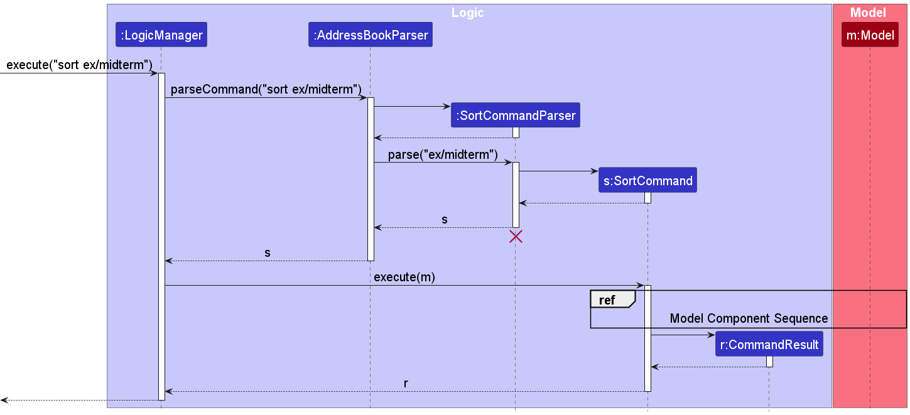
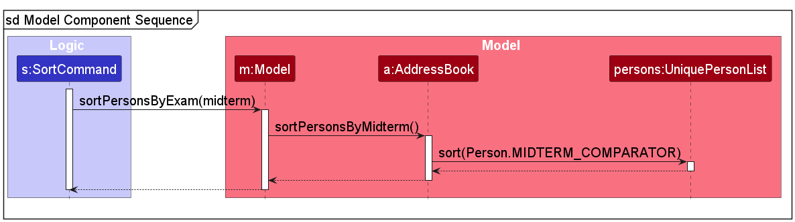

* Table of Contents
{:toc}

--------------------------------------------------------------------------------------------------------------------

## **Acknowledgements**

* This project is based on the AddressBook-Level3 project created by the [SE-EDU initiative](https://se-education.org).
* The automated GUI tests using TestFX was adapted from the AddressBook-Level4 project by the same creator.

--------------------------------------------------------------------------------------------------------------------

## **Setting up, getting started**

Refer to the guide [_Setting up and getting started_](SettingUp.md).

--------------------------------------------------------------------------------------------------------------------

## **Design**

:bulb: **Tip:** The `.puml` files used to create diagrams are in this document `docs/diagrams` folder. Refer to the [_PlantUML Tutorial_ at se-edu/guides](https://se-education.org/guides/tutorials/plantUml.html) to learn how to create and edit diagrams.

### Architecture

The ***Architecture Diagram*** given above explains the high-level design of CadetHQ.

Given below is a quick overview of main components and how they interact with each other.

**Main components of the architecture**

**`Main`** (consisting of classes [`Main`](https://github.com/AY2526S1-CS2103T-T11-2/tp/blob/master/src/main/java/seedu/address/Main.java) and [`MainApp`](https://github.com/AY2526S1-CS2103T-T11-2/tp/blob/master/src/main/java/seedu/address/MainApp.java)) is in charge of the app launch and shut down.
* At app launch, it initializes the other components in the correct sequence, and connects them up with each other.
* At shut down, it shuts down the other components and invokes cleanup methods where necessary.

The bulk of the app's work is done by the following four components:

* [**`UI`**](#ui-component): The UI of CadetHQ.
* [**`Logic`**](#logic-component): The command executor.
* [**`Model`**](#model-component): Holds the data of the CadetHQ in memory.
* [**`Storage`**](#storage-component): Reads data from, and writes data to, the hard disk.

[**`Commons`**](#common-classes) represents a collection of classes used by multiple other components.

**How the architecture components interact with each other**

The *Sequence Diagram* below shows how the components interact with each other for the scenario where the user issues the command `delete 1`.

Each of the four main components (also shown in the diagram above),

* defines its *API* in an `interface` with the same name as the Component.
* implements its functionality using a concrete `{Component Name}Manager` class (which follows the corresponding API `interface` mentioned in the previous point).

For example, the `Logic` component defines its API in the `Logic.java` interface and implements its functionality using the `LogicManager.java` class which follows the `Logic` interface. Other components interact with a given component through its interface rather than the concrete class (reason: to prevent outside component's being coupled to the implementation of a component), as illustrated in the (partial) class diagram below.

The sections below give more details of each component.

### UI component

The **API** of this component is specified in [`Ui.java`](https://github.com/AY2526S1-CS2103T-T11-2/tp/blob/master/src/main/java/seedu/address/ui/Ui.java)

The UI consists of a `MainWindow` that is made up of parts e.g.`CommandBox`, `ResultDisplay`, `PersonListPanel`, `StatusBarFooter` etc. All these, including the `MainWindow`, inherit from the abstract `UiPart` class which captures the commonalities between classes that represent parts of the visible GUI.

The `UI` component uses the JavaFx UI framework. The layout of these UI parts are defined in matching `.fxml` files that are in the `src/main/resources/view` folder. For example, the layout of the [`MainWindow`](https://github.com/AY2526S1-CS2103T-T11-2/tp/blob/master/src/main/java/seedu/address/ui/MainWindow.java) is specified in [`MainWindow.fxml`](https://github.com/AY2526S1-CS2103T-T11-2/tp/blob/master/src/main/resources/view/MainWindow.fxml)

The `UI` component,

* executes user commands using the `Logic` component.
* listens for changes to `Model` data so that the UI can be updated with the modified data.
* keeps a reference to the `Logic` component, because the `UI` relies on the `Logic` to execute commands.
* depends on some classes in the `Model` component, as it displays `Person` object residing in the `Model`.

### Logic component

**API** : [`Logic.java`](https://github.com/AY2526S1-CS2103T-T11-2/tp/blob/master/src/main/java/seedu/address/logic/Logic.java)

Here's a (partial) class diagram of the `Logic` component:

The sequence diagram below illustrates the interactions within the `Logic` component, taking `execute("delete 1")` API call as an example.

:information_source: **Note:** The lifeline for `DeleteCommandParser` should end at the destroy marker (X) but due to a limitation of PlantUML, the lifeline continues till the end of diagram.

How the `Logic` component works:

1. When `Logic` is called upon to execute a command, it is passed to an `AddressBookParser` object which in turn creates a parser that matches the command (e.g., `DeleteCommandParser`) and uses it to parse the command.
1. This results in a `Command` object (more precisely, an object of one of its subclasses e.g., `DeleteCommand`) which is executed by the `LogicManager`.
1. The command can communicate with the `Model` when it is executed (e.g. to delete a person). 
   Note that although this is shown as a single step in the diagram above (for simplicity), in the code it can take several interactions (between the command object and the `Model`) to achieve.
1. The result of the command execution is encapsulated as a `CommandResult` object which is returned back from `Logic`.

Here are the other classes in `Logic` (omitted from the class diagram above) that are used for parsing a user command:

How the parsing works:
* When called upon to parse a user command, the `AddressBookParser` class creates an `XYZCommandParser` (`XYZ` is a placeholder for the specific command name e.g., `AddCommandParser`) which uses the other classes shown above to parse the user command and create a `XYZCommand` object (e.g., `AddCommand`) which the `AddressBookParser` returns back as a `Command` object.
* All `XYZCommandParser` classes (e.g., `AddCommandParser`, `DeleteCommandParser`, ...) inherit from the `Parser` interface so that they can be treated similarly where possible e.g, during testing.

### Model component
**API** : [`Model.java`](https://github.com/AY2526S1-CS2103T-T11-2/tp/blob/master/src/main/java/seedu/address/model/Model.java)

The `Model` component,

* stores the `AddressBook` data i.e., all `Person` objects (which are contained in a `UniquePersonList` object).
* stores the currently 'selected' `Person` objects (e.g., results of a search query) as a separate _filtered_ list which is exposed to outsiders as an unmodifiable `ObservableList<Person>` that can be 'observed' e.g. the UI can be bound to this list so that the UI automatically updates when the data in the list change.
* stores a `UserPref` object that represents the user’s preferences. This is exposed to the outside as a `ReadOnlyUserPref` objects.
* does not depend on any of the other three components (as the `Model` represents data entities of the domain, they should make sense on their own without depending on other components)

:information_source: **Note:** An alternative (arguably, a more OOP) model is given below. It has a `Tag` list in the `AddressBook`, which `Person` references. This allows `AddressBook` to only require one `Tag` object per unique tag, instead of each `Person` needing their own `Tag` objects. 

### Storage component

**API** : [`Storage.java`](https://github.com/AY2526S1-CS2103T-T11-2/tp/blob/master/src/main/java/seedu/address/storage/Storage.java)

The `Storage` component,
* can save both `AddressBook` data and user preference data in JSON format, and read them back into corresponding objects.
* inherits from both `AddressBookStorage` and `UserPrefStorage`, which means it can be treated as either one (if only the functionality of only one is needed).
* depends on some classes in the `Model` component (because the `Storage` component's job is to save/retrieve objects that belong to the `Model`)

Persistent data is stored as local JSON files, located in the same folder where the JAR file for CadetHQ is ran. The following JSON files are created:

- `preferences.json`
- `config.json`
- `data/cadethq.json`

[Jackson](https://github.com/FasterXML/jackson) is used for JSON (de)serialization and relies on adapted models via the [Data Transfer Object pattern](https://www.baeldung.com/java-dto-pattern).

#### Malformed JSONs

If a JSON file is malformed, the contents will not be loaded and a log message will be printed. A malformed JSON file includes files that have invalid JSON syntax or files that are missing crucial user data.

No proactive measures are taken to rectify the issue, such as deleting the file or fixing the error. This decision was made to avoid prescribing a fixed approach to resolving malformed JSON files. Instead, we simply load sensible defaults, such as placeholder data when the user loads the application, and overwrite the malformed JSON file when the user inputs data.

For `data/cadethq.json`, this occurs when adding, editing or deleting the student contact list.

For `preferences.json`, this occurs in the `MainApp#initPrefs` method.

For `config.json`, this occurs in the `MainApp#initConfig` method.

### Common classes

Classes used by multiple components are in the `seedu.address.commons` package.

--------------------------------------------------------------------------------------------------------------------

## **Implementation**

This section describes some noteworthy details on how certain features are implemented.

### Sort Command
**Overview**

Sort command sorts the list of students according to the argument `n/` or `ex/`.

Below is the sequence diagram that describes how sorting is done. The example below uses `sort ex/midterm` as an example:

**Logic Component**

:information_source: **Note:** The lifeline for `SortCommandParser` should end at the destroy marker (X) but due to a limitation of PlantUML, the lifeline reaches the end of diagram.

:information_source: **Note:** The reference frame name should be at the top left corner, but due to a limitation with PlantUML, it is at the bottom middle.

**Model Component**

**Details**:

Sorting is implemented through 3 comparators (`Comparator<Person>`) in the `Person` class as below:
* `NAME_COMPARATOR`: Used to sort in ascending alphabetical order.
* `MIDTERM_COMPARATOR`: Used to sort in ascending midterm score order. Students with no recorded midterm scores will be flushed to the end of the list.
* `FINAL_COMPARATOR`: Same as MIDTERM_COMPARATOR, but compares final score instead.

`Model` also contains a method to sort by exam (`sortPersonsByExam(EXAM)`) and by name (`sortPersonsByName()`).

`AddressBook` has 3 sorting methods that utilise the 3 `Comparator<Person>` above for sorting:
* `sortPersonsbyName()`
* `sortPersonsByMidterm()`
* `sortPersonsByFinal()`

### Edit the maximum score of an exam
**Overview**

The `maxscore` command allows the user to edit the maximum score of an exam in the `AddressBook`.

The sequence diagrams below illustrates the interactions within the `Logic` and `Model` components, taking `execute("maxscore ex/final ms/105")` API call as an example.

**Logic Component**

:information_source: **Note:** The lifeline for `EditScoreCommandParser` should end at the destroy marker (X) but due to a limitation of PlantUML, the lifeline reaches the end of diagram.

:information_source: **Note:** The reference frame name should be at the top left corner, but due to a limitation with PlantUML, it is at the bottom middle.

**Details**:
1. The `LogicManager` object will be called to execute the input.
2. The `AddressBookParser` object will identify the command as `EditScoreCommand`, and create an `EditScoreCommandParser`.
3. The `EditScoreCommandParser` will parse `ex/final ms/105` and create an `EditCommand` which is returned to the `LogicManager`.
4. The `LogicManager` calls `execute` on the `EditScoreCommand` object, which interacts with the Model component. (drawn as a single step for simplicity)
5. The result of the command execution is encapsulated as a `CommandResult` object which is returned back from `Logic`.

**Model Component**

**Details**:
1. The `execute` method in `EditScoreCommand` runs.
2. The `EditScoreCommand` object calls `isValidExam` and `isNewMaxScoreValid` to verify that `final` exists, and that the new max score meets all constraints.
- (Not shown in diagram) The `isNewMaxScoreValid` method compares the new max score `105` against all the recorded scores for all students, for the exam `final`. The new max score must be greater than or equal to all recorded scores for it to be valid.
3. The `EditScoreCommand` object calls `setMaxScore` on `Exam` to change the max score.
4. The `EditScoreCommand` object calls `getFilteredPersonList` on `Model` to retrieve all displayed people.
5. (Simplified in diagram) For each `Person` in the person list, a clone is created with the same information. The method `setPerson` of `Model` replaces each `Person` with the cloned `Person`, ensuring that the updated max score is reflected in the UI.

### \[Proposed\] Undo/redo feature

#### Proposed Implementation

The proposed undo/redo mechanism is facilitated by `VersionedAddressBook`. It extends `AddressBook` with an undo/redo history, stored internally as an `addressBookStateList` and `currentStatePointer`. Additionally, it implements the following operations:

* `VersionedAddressBook#commit()` — Saves the current `AddressBook` state in its history.
* `VersionedAddressBook#undo()` — Restores the previous `AddressBook` state from its history.
* `VersionedAddressBook#redo()` — Restores a previously undone `AddressBook` state from its history.

These operations are exposed in the `Model` interface as `Model#commitAddressBook()`, `Model#undoAddressBook()` and `Model#redoAddressBook()` respectively.

Given below is an example usage scenario and how the undo/redo mechanism behaves at each step.

Step 1. The user launches the application for the first time. The `VersionedAddressBook` will be initialized with the initial `AddressBook` state, and the `currentStatePointer` pointing to that single `AddressBook` state.

Step 2. The user executes `delete 5` command to delete the 5th person in the `AddressBook`. The `delete` command calls `Model#commitAddressBook()`, causing the modified state of the `AddressBook` after the `delete 5` command executes to be saved in the `addressBookStateList`, and the `currentStatePointer` is shifted to the newly inserted `AddressBook` state.

Step 3. The user executes `add n/David …​` to add a new person. The `add` command also calls `Model#commitAddressBook()`, causing another modified `AddressBook` state to be saved into the `addressBookStateList`.

:information_source: **Note:** If a command fails its execution, it will not call `Model#commitAddressBook()`, so the `AddressBook` state will not be saved into the `addressBookStateList`.

Step 4. The user now decides that adding the person was a mistake, and decides to undo that action by executing the `undo` command. The `undo` command will call `Model#undoAddressBook()`, which will shift the `currentStatePointer` once to the left, pointing it to the previous `AddressBook` state, and restores the `AdressBook` to that state.

:information_source: **Note:** If the `currentStatePointer` is at index 0, pointing to the initial AddressBook state, then there are no previous AddressBook states to restore. The `undo` command uses `Model#canUndoAddressBook()` to check if this is the case. If so, it will return an error to the user rather
than attempting to perform the undo.

The following sequence diagram shows how an undo operation goes through the `Logic` component:

:information_source: **Note:** The lifeline for `UndoCommand` should end at the destroy marker (X) but due to a limitation of PlantUML, the lifeline reaches the end of diagram.

Similarly, how an undo operation goes through the `Model` component is shown below:

The `redo` command does the opposite — it calls `Model#redoAddressBook()`, which shifts the `currentStatePointer` once to the right, pointing to the previously undone state, and restores the `AddressBook` to that state.

:information_source: **Note:** If the `currentStatePointer` is at index `addressBookStateList.size() - 1`, pointing to the latest `AddressBook` state, then there are no undone AddressBook states to restore. The `redo` command uses `Model#canRedoAddressBook()` to check if this is the case. If so, it will return an error to the user rather than attempting to perform the redo.

Step 5. The user then decides to execute the command `list`. Commands that do not modify the `AddressBook`, such as `list`, will usually not call `Model#commitAddressBook()`, `Model#undoAddressBook()` or `Model#redoAddressBook()`. Thus, the `addressBookStateList` remains unchanged.

Step 6. The user executes `clear`, which calls `Model#commitAddressBook()`. Since the `currentStatePointer` is not pointing at the end of the `addressBookStateList`, all `AddressBook`
states after the `currentStatePointer` will be purged. Reason: It no longer makes sense to redo the `add n/David …​` command. This is the behavior that most modern desktop applications follow.

The following activity diagram summarizes what happens when a user executes a new command:

#### Design considerations:

**Aspect: How undo & redo executes:**

* **Alternative 1 (current choice):** Saves the entire `AddressBook`.
  * Pros: Easy to implement.
  * Cons: May have performance issues in terms of memory usage.

* **Alternative 2:** Individual command knows how to undo/redo by
  itself.
  * Pros: Will use less memory (e.g. for `delete`, just save the person being deleted).
  * Cons: We must ensure that the implementation of each individual command are correct.

--------------------------------------------------------------------------------------------------------------------

## **Documentation, logging, testing, configuration, dev-ops**

* [Documentation guide](Documentation.md)
* [Testing guide](Testing.md)
* [Logging guide](Logging.md)
* [Configuration guide](Configuration.md)
* [DevOps guide](DevOps.md)

--------------------------------------------------------------------------------------------------------------------

## **Appendix: Requirements**

### Product scope

**Target user profile**: CS1101S TAs

* has a need to manage a significant number of student contacts, attendance and grades
* is more active on their laptop/desktop than other devices
* can type fast
* prefers typing to mouse interactions
* is very comfortable using CLI applications
* enjoy a minimalistic GUI

**Value proposition**: CadetHQ can help busy CS1101S TAs manage their students' contacts, tutorial attendance, and exam scores. The mix of CLI and GUI allows information to be delivered clearly and for quick interaction with CadetHQ.

### User stories

Priorities: High (must have) - `* * *`, Medium (nice to have) - `* *`, Low (unlikely to have) - `*`

| Priority | As a …​              | I want to …​                                                | So that I can…​                                                        |
|----------|----------------------|-------------------------------------------------------------|------------------------------------------------------------------------|
| `* * *`  | CS1101S TA           | add a new student's profile                                 | keep track of all my students in my course                             |
| `* * *`  | CS1101S TA           | edit a student's profile                                    | update the records when corrections are needed                         |
| `* * *`  | CS1101S TA           | delete a student's profile                                  | remove the student's profile when it is not needed anymore             |
| `* * *`  | CS1101S TA           | list out all students                                       | see whose contacts I have saved                                        |
| `* * *`  | CS1101S TA           | view a student's contact information                        | contact a student directly if needed                                   |
| `* * *`  | CS1101S TA           | view a student's grades                                     | have a comprehensive overview of each student's performance            |
| `* * *`  | CS1101S TA           | view students' attendance                                   | keep track of when a student has not shown up to class                 |
| `* * *`  | CS1101S TA           | search for a student's profile by name, index or student ID | quickly locate a student and access their information                  |
| `* * *`  | CS1101S TA           | record a student's grades                                   | keep accurate records of their performance                             |
| `* * *`  | CS1101S TA           | edit the maximum score of the exams                         | edit the maximum score of exams, in the event of any changes           |
| `* * *`  | CS1101S TA           | mark students' attendance                                   | keep track of who attends the tutorial class                           |
| `* * *`  | CS1101S TA           | backup the recorded student information                     | retain the data I recorded after the application is closed             |
| `* *`    | first time user      | view a help message with all commands                       | easily learn how to use CadetHQ                                        |
| `* *`    | concerned CS1101S TA | sort my students by grade                                   | easily identify which students need more support                       |
| `* *`    | concerned CS1101S TA | tag students with labels                                    | keep track of which students need more help with particular topics     |
| `*`      | CS1101S TA           | use CadetHQ to manage my students contacts                  | keep my work and personal contacts separate                            |
| `*`      | first time user      | view CadetHQ populated with sample data                     | understand how CadetHQ is structured before I customise it to my needs |

### Use cases

(For all use cases below, the **System** is `CadetHQ` and the **Actor** is the `user`, unless specified otherwise)

___

**Use case: UC01 - Add a student contact**

**MSS**

1.  User requests to add student contact, inputting student's ID, name and contact details
2.  CadetHQ creates student contact
3.  CadetHQ displays student contact

    Use case ends.

**Extensions**

* 1a. Student details missing in input.
    * 1a1. CadetHQ shows an error message.
    * 1a2. User makes the request again with updated details.

      Steps 1a1 - 1a2 are repeated until the input is valid.

      Use case resumes from step 1.

* 1b. A contact with the given student ID already exists.
    * 1b1. CadetHQ shows an error message.
    * 1b2. User makes the request again with updated details.

      Steps 1b1 - 1b2 are repeated until the input is valid.

      Use case resumes from step 1.

* 1c. A contact with the given email already exists.
    * 1c1. CadetHQ shows an error message.
    * 1c2. User makes the request again with updated details.

      Steps 1c1 - 1c2 are repeated until the input is valid.

      Use case resumes from step 1.

* 1d. Details are not in an acceptable format.
    * 1d1. CadetHQ shows an error message.
    * 1d2. User makes the request again with updated format.

      Steps 1d1 - 1d2 are repeated until the format is accepted.

      Use case resumes from step 1.

___

**Use case: UC02 - List all students**

**MSS**

1.  User requests to list students.
2.  CadetHQ shows the full list of students.

    Use case ends.

___

**Use case: UC03 - Find students(s)**

**MSS**

1. User requests to find student(s).
2. CadetHQ shows the list of found students.

    Use case ends.

___

**Use case: UC04 - Delete a student contact using list index**

**MSS**

1.  User requests to delete a specific student in the list using index in list
2.  CadetHQ deletes the student's contact

    Use case ends.

**Extensions**

* 1a. The list is empty.
    * 1a1. CadetHQ shows an error message.

      Use case ends.

* 1b. The given index is invalid and/or out of bounds.
    * 1b1. CadetHQ shows an error message.
    * 1b2. User makes the request again with updated index.

      Steps 1b1 - 1b2 repeat until the index is valid and in bounds.

      Use case resumes at step 2.

___

**Use case: UC05 - Delete a student contact using Student ID**

**MSS**

1.  User requests to delete a specific student in the list using Student ID
2.  CadetHQ deletes the student's contact

    Use case ends.

**Extensions**

* 1a. The list is empty.
    * CadetHQ shows an error message.
      Use case ends.

* 1b. The given Student ID is invalid.
    * 1b1. CadetHQ shows an error message.
    * 1b2. User makes the request again with updated Student ID.

      Steps 1b1 - 1b2 repeat until the Student ID is valid.

      Use case resumes at step 1.

* 1c. The given Student ID is not in the list.
    * 1c1. CadetHQ shows an error message.
    * 1c2. User makes the request again with updated Student ID.

      Steps 1c1 - 1c2 repeat until the Student ID is one found in the list.

      Use case resumes at step 2.

___

**Use case: UC06 - Edit a student contact via list index**

**MSS**

1. User requests to edit a specific contact in the list using index in list.
2. CadetHQ edits the contact and displays updated information.

    Use case ends.

**Extensions**

* 1a. The list is empty.
    * 1a1. CadetHQ shows an error message.

      Use case ends.

* 1b. The index is invalid and/or out of bounds.
    * 1b1. CadetHQ shows an error message.
    * 1b2. User makes request again with updated index.

      Steps 1b1 - 1b2 repeat until the index is valid.

      Use case resumes from step 1.

* 1c. User did not specify any information to update.
    * 1c1. CadetHQ shows an error message.
    * 1c2. User makes request again with updated information.

      Steps 1c1 - 1c2 repeat until there is information to update.

      Use case resumes from step 1.

* 1d. User's requested edit contains a duplicate email.
    * 1d1. CadetHQ shows an error message.
    * 1d2. User makes request again with updated information.

      Steps 1d1 - 1d2 repeat until the edit does not contain a duplicate email.

      Use case resumes from step 1.

* 1e. Details are not in an acceptable format.
    * 1e1. CadetHQ shows an error message.
    * 1e2. User makes the request again with updated format.

      Steps 1e1 - 1e2 are repeated until the format is accepted.

      Use case resumes from step 1.

___

**Use case: UC07 - Edit a student contact via Student ID**

**MSS**

1. User requests to edit a specific contact in the list using Student ID.
2. CadetHQ edits the contact and displays updated information.

    Use case ends.

**Extensions**

* 1a. The list is empty.
    * 1a1. CadetHQ shows an error message.

      Use case ends.

* 1b. The student ID is invalid.
    * 1b1. CadetHQ shows an error message.
    * 1b2. User makes request again with updated index.

      Steps 1b1 - 1b2 repeat until the index is valid.

      Use case resumes from step 1.

* 1c. The given Student ID is not in the list.
    * 1c1. CadetHQ shows an error message.
    * 1c2. User makes the request again with updated Student ID.

      Steps 1c1 - 1c2 repeat until the Student ID is one found in the list.

      Use case resumes at step 1.

* 1d. User did not specify any information to update.
    * 1d1. CadetHQ shows an error message.
    * 1d2. User makes request again with updated information.

      Steps 1d1 - 1d2 repeat until there is information to update.

      Use case resumes from step 1.

* 1e. User's requested edit contains a duplicate email.
    * 1e1. CadetHQ shows an error message.
    * 1e2. User makes request again with updated information.

      Steps 1e1 - 1e2 repeat until the edit does not contain a duplicate email.

      Use case resumes from step 1.

* 1f. Details are not in an acceptable format.
    * 1f1. CadetHQ shows an error message.
    * 1f2. User makes the request again with updated format.

      Steps 1f1 - 1f2 are repeated until the format is accepted.

      Use case resumes from step 1.

___

**Use case: UC08 - View a student contact via list index**

**MSS**

1.  User requests to view a specific student in the list
2.  CadetHQ displays the student's contact

    Use case ends.

**Extensions**

* 1a. The list is empty.
    * 1a1. CadetHQ shows an error message.

      Use case ends.

* 1b. The given index is invalid and/or out of bounds.
    * 1b1. CadetHQ shows an error message.
    * 1b2. User makes the request again with updated index.

      Steps 1b1 - 1b2 repeat until the index is valid and in bounds.

      Use case resumes at step 2.

___

**Use case: UC09 - View a student contact via Student ID**

**MSS**

1.  User requests to view a specific student using Student ID
2.  CadetHQ displays the student's contact

    Use case ends.

**Extensions**

* 1a. The list is empty.
    * 1a1. CadetHQ shows an error message.

      Use case ends.

* 1b. The student ID is invalid.
    * 1b1. CadetHQ shows an error message.
    * 1b2. User makes request again with updated index.

      Steps 1b1 - 1b2 repeat until the index is valid.

      Use case resumes from step 1.

* 1c. The given Student ID is not in the list.
    * 1c1. CadetHQ shows an error message.
    * 1c2. User makes the request again with updated Student ID.

      Steps 1c1 - 1c2 repeat until the Student ID is one found in the list.

      Use case resumes at step 2.

___

**Use case: UC10 - Record a student's grade via list index**

**MSS**

1.  User requests to record grade of a specific student in the list, inputting test name and score
2.  CadetHQ updates student's record
3.  CadetHQ displays student's grade

    Use case ends.

**Extensions**

* 1a. The list is empty.
    * 1a1. CadetHQ shows an error message.

      Use case ends.

* 1b. The given index is invalid and/or out of bounds.
    * 1b1. CadetHQ shows an error message.
    * 1b2. User makes the request again with updated index.

      Steps 1b1 - 1b2 repeat until the index is valid and in bounds.

      Use case resumes at step 1.

* 1c. Details missing in input.
    * 1c1. CadetHQ shows an error message.
    * 1c2. User makes request again with updated information.

      Steps 1c1 - 1c2 repeat until there are no missing details.

      Use case resumes at step 1.

* 1d. Details are not in an acceptable format.
    * 1d1. CadetHQ shows an error message.
    * 1d2. User makes request again with updated format.

      Steps 1d1 - 1d2 repeat until formatting is acceptable.

      Use case resumes at step 1.

___

**Use case: UC11 - Record a student's grade via Student ID**

**MSS**

1.  User requests to record grade of a specific student using Student ID, inputting test name and score
2.  CadetHQ updates student's record
3.  CadetHQ displays student's grade

    Use case ends.

**Extensions**

* 1a. The list is empty.
    * 1a1. CadetHQ shows an error message.

      Use case ends.

* 1b. The student ID is invalid.
    * 1b1. CadetHQ shows an error message.
    * 1b2. User makes request again with updated index.

      Steps 1b1 - 1b2 repeat until the index is valid.

      Use case resumes from step 1.

* 1c. The given Student ID is not in the list.
    * 1c1. CadetHQ shows an error message.
    * 1c2. User makes the request again with updated Student ID.

      Steps 1c1 - 1c2 repeat until the Student ID is one found in the list.

      Use case resumes at step 1.

* 1d. Details missing in input.
    * 1d1. CadetHQ shows an error message.
    * 1d2. User makes request again with updated information.

      Steps 1d1 - 1d2 repeat until there are no missing details.

      Use case resumes at step 1.

* 1e. Details are not in an acceptable format.
    * 1e1. CadetHQ shows an error message.
    * 1e2. User makes request again with updated format.

      Steps 1e1 - 1e2 repeat until formatting is acceptable.

      Use case resumes at step 1.

___

**Use case: UC12 - Record a student's attendance via list index**

**MSS**

1.  User requests to record attendance of a specific student in the list, inputting tutorial number
2.  CadetHQ inverts student's attendance
3.  CadetHQ displays student's attendance

    Use case ends.

**Extensions**

* 1a. The list is empty.

  Use case ends.

* 1b. The given index is invalid and/or out of bounds.
    * 1b1. CadetHQ shows an error message.
    * 1b2. User makes request again with updated index.

      Steps 1b1 - 1b2 repeat until index is valid and in bounds.

      Use case resumes at step 2.

* 1c. Details missing in input.
    * 1c1. CadetHQ shows an error message.
    * 1c2. User makes request again with updated details.

      Steps 1c1 - 1c2 repeat until the details are all complete.

      Use case resumes at step 1.

* 1d. Details are not in an acceptable format.
    * 1d1. CadetHQ shows an error message.
    * 1d2. User makes the request again with updated details.

      Steps 1d1 - 1d2 are repeated until the format is accepted.

      Use case resumes from step 1.

___

**Use case: UC13 - Record a student's attendance via Student ID**

**MSS**

1.  User requests to record attendance of a specific student using Student ID, inputting tutorial number
2.  CadetHQ inverts student's attendance
3.  CadetHQ displays student's attendance

    Use case ends.

**Extensions**

* 1a. The list is empty.

  Use case ends.

* 1b. The student ID is invalid.
    * 1b1. CadetHQ shows an error message.
    * 1b2. User makes request again with updated index.

      Steps 1b1 - 1b2 repeat until the index is valid.

      Use case resumes from step 1.

* 1c. The given Student ID is not in the list.
    * 1c1. CadetHQ shows an error message.
    * 1c2. User makes the request again with updated Student ID.

      Steps 1c1 - 1c2 repeat until the Student ID is one found in the list.

      Use case resumes at step 1.

* 1d. Details missing in input.
    * 1d1. CadetHQ shows an error message.
    * 1d2. User makes request again with updated details.

      Steps 1d1 - 1d2 repeat until the details are complete.

      Use case resumes at step 1.

* 1e. Details are not in an acceptable format.
    * 1e1. CadetHQ shows an error message.
    * 1e2. User makes the request again with updated details.

      Steps 1e1 - 1e2 are repeated until the format is accepted.

      Use case resumes from step 1.

___

**Use case: UC14 - Sort all students by exam score**

**MSS**

1.  User requests to sort students by a specified exam.
2.  CadetHQ shows a sorted list of persons from the lowest score to highest. Those with unrecorded scores for the specified exam will have their names pushed to the bottom of the list.

    Use case ends.

___

**Use case: UC15 - Sort all students by name**

**MSS**

1.  User requests to sort students by name.
2.  CadetHQ shows a sorted list of persons in ascending alphabetical order.

    Use case ends.

___

**Use case: UC16 - Edit max score of exam**

**MSS**

1. User requests to edit max score of a specified exam.
2. CadetHQ updates the max score of the exam. All students with recorded scores for that exam will display the new max score.

    Use case ends.

**Extensions**

* 1a. User inputs an invalid max score
    * 1a1. CadetHQ shows an error message.
    * 1a2. User makes request again with updated max score.

      Steps 1a1 - 1a2 repeat until the max score is valid.

     Use case resumes at step 1.

* 1b. User inputs an invalid exam not supported in CadetHQ
    * 1b1. CadetHQ shows an error message.
    * 1b2. User makes request again with updated exam.

      Steps 1b1 - 1b2 repeat until the exam is valid.

     Use case resumes at step 1.

* 1c. Details missing in input.
    * 1c1. CadetHQ shows an error message.
    * 1c2. User makes request again with updated details.

      Steps 1c1 - 1c2 repeat until the details are complete.

      Use case resumes at step 1.

* 1d. Details are not in an acceptable format.
    * 1d1. CadetHQ shows an error message.
    * 1d2. User makes the request again with updated details.

      Steps 1d1 - 1d2 are repeated until the format is accepted.

      Use case resumes from step 1.

___

### Non-Functional Requirements

1.  Should work on any _mainstream OS_ as long as it has Java `17` or above installed.
2.  Should be able to work with different screen resolutions as long as it meets the minimum window size of 450 x 600px.
3.  Should be able to start up within **5 seconds** on modern computer hardware (within the last 10 years).
4.  Should be able to hold up to **200 people** without a noticeable sluggishness in performance for typical usage.
5.  Command execution should not take more than **5 seconds**. For example, editing or adding a person should not take more than 5 seconds for the changes to be reflected in CadetHQ.
6.  A user with above average typing speed for regular English text (i.e. not code, not system admin commands) should be able to accomplish most of the tasks faster using commands than using the mouse.
7.  Should work without installation.
8.  Should be usable by a CS1101S TA that has never used similar contact management applications before.
9.  Should be for a single user only (i.e. not a multi-user product, no shared file storage mechanism, no application running in a shared computer).
10. Invalid commands should not crash CadetHQ, but show an error message instead.
11. A user should be able to access command help information at any time.
12. The source code should be open source.

### Glossary

* **Mainstream OS**: Windows, Linux, Unix, MacOS.
* **CLI**: Command-Line Interface - A text-based interface for interacting with CadetHQ by typing commands.
* **GUI**: Graphical User Interface - A visual interface that uses windows, buttons and menus, which is not the primary interface of the app.
* **NUS**: National University of Singapore.
* **CS1101S**: Programming Methodology module for NUS Computer Science students.
* **TA**: Teaching Assistant - The target users of CadetHQ.
* **Student ID**: A unique identifier assigned to each student in NUS.
* **Index**: The position of the student in the displayed list, starting from 1.
* **JSON**: JavaScript Object Notation - A data format used to store and transfer information. CadetHQ stores data in JSON files.
* **JAR**: Java Archive - The packaged form of the application that can be distributed and executed.

--------------------------------------------------------------------------------------------------------------------

## **Appendix: Planned Enhancements**

1. **Add/edit/delete exams**: CadetHQ currently only supports the recording of 2 static exams (midterm and final). Adding the ability to add more assessments manually such as <u>reading assessments</u> and <u>practical exams</u> allows TAs to monitor their students progress better throughout the semester. Being able to edit and delete exams allows TAs to have more flexibility in exam tracking if the curriculum changes in the future.

2. **Improve GUI for displaying of exam scores**: The current GUI displays the midterm and exam scores under each student. As more assessments are added, this may clutter the screen. A **dropdown menu** can be added to only show the exam scores when clicked.

3. **Mass attendance marking**: CadetHQ currently only allows the user to mark each student's attendance one at a time. Adding the ability to mass record attendance makes it easier to mark all students in a tutorial. Some proposed implementations are shown below:
    * `massattend 1-10 1`: marks attendance for students from index 1 to 10 in the list for tutorial 1.
    * `massattend t/TAG 5`: marks attendance for students with the specified `TAG` for tutorial 5.

4. **Enhanced find functionality**: CadetHQ currently only allows the user to search by name. Adding the ability to search by tutorial attended or tags, and allowing partial matches makes it easier for the user to find the students they are looking for.

5. **Improve GUI for displaying attendance**: The current GUI only displays tutorials that students have attended. Instead, it could show all the tutorials, and colour them red and green based on whether students have attended or not.

6. **More sorting**: Currently, CadetHQ only supports sorting in ascending order of names and exams. Add more sorting options like sorting in descending order or by attendance allows TAs to have more flexibility in list management.

--------------------------------------------------------------------------------------------------------------------

## **Appendix: Instructions for manual testing**

Given below are instructions to test the application manually.

:information_source: **Note:** These instructions only provide a starting point for testers to work on;
testers are expected to do more *exploratory* testing.

### Launch and shutdown

1. Initial launch

   1. Download the jar file and copy into an empty folder

   2. Double-click the jar file Expected: Shows the GUI with a set of sample contacts. The window size may not be optimum.

2. Shutdown

   1. Prerequisites: CadetHQ is currently still running.

   2. Test case: Click on the <code style="color : name_color">X button</code> at the top right of CadetHQ. 
      Expected: CadetHQ closes.

   3. Test case: Use the `exit` command in the text box. 
      Expected: CadetHQ closes.

3. Saving window preferences

   1. Resize the window to an optimum size. Move the window to a different location. Close the window.

   2. Re-launch the application by double-clicking the jar file. 
      Expected: The most recent window size and location is retained.

### Adding a person

1. Adding a person

   1. Test case: `add A0235410A n/John Doe p/98765432 e/johnd@u.nus.edu h/@John t/friends t/owesMoney` 
      Expected: Contact is added to the list. Details of added contact shown in the status message.

   2. Test case: `add A0235411A n/Jon Doe p/98765431 e/jond@u.nus.edu t/friends t/owesMoney` 
      Expected: Contact is not added to the list. Error details shown in the status message.

   3. Test case: `add A0235411A n/Jon Doe p/98765431 e/jond@gmail.com` 
      Expected: Contact is not added to the list. Error details shown in the status message.

   4. Other incorrect add commands to try: `add`, `add ...`(Any combination of missing fields), `...` 
      Expected: Similar to previous.

2. Adding a person with non-unique fields

   1. Prerequisites: List all persons using the `list` command. Person with Student ID 'A0000000A', email 'alexyeoh@u.nus.edu' in the list.

   2. Test case: `add A0000000A n/Billy p/98765432 e/billybatson@u.nus.edu h/@Billy123` 
      Expected: Contact is not added to the list. Error details shown in the status message.

   3. Test case: `add A1234567B n/Billy p/98765432 e/alexyeoh@u.nus.edu h/@Billy123` 
      Expected: Contact is not added to the list. Error details shown in the status message.

### Deleting a person

1. Deleting a person while all persons are being shown

   1. Prerequisites: List all persons using the `list` command. Multiple persons in the list.

   2. Test case: `delete 1` 
      Expected: First contact is deleted from the list. Details of the deleted contact shown in the status message.

   3. Test case: `delete 0` 
      Expected: No person is deleted. Error details shown in the status message.

   4. Other incorrect delete commands to try: `delete`, `delete x`, `...` (where x is larger than the list size) 
      Expected: Similar to previous.

### Editing a person

1. Editing a person

    1. Prerequisites: List all persons using the `list` command. One person in list with Student ID 'A0000000A'. Another person in list with email 'berniceyu@u.nus.edu'.

    2. Test case: `edit A0000000A p/98765432` 
       Expected: Contact with Student ID A0000000A is edited. Details of edited contact shown in the status message.

    3. Test case: `edit A0000000A e/berniceyu@u.nus.edu` 
       Expected: Contact is not edited. Error details shown in the status message.

    4. Other incorrect edit commands to try: `edit`, `edit 1 e/abc@gmail.com`, `...` 
       Expected: Similar to previous.

### Updating Attendance

1. Updating Attendance for a tutorial using list index

   1. Prerequisites: List all persons using the `list` command. At least one person in the list

   2. Test case: `attend 1 1` 
      Expected: Attendance is inverted for Tutorial 1 for the first contact. Details of attend shown in the status message.

   3. Test case: `attend 1 0` 
      Expected: No attendance is taken. Error details shown in the status message.

   4. Test case: `attend` 
      Expected: No attendance is taken. Error details shown in the status message.

   5. Other incorrect attend commands to try: `attend 1 x`, `attend y 1`, `...` (where x is larger than the number of tutorials and y is larger than the list size) 
      Expected: Similar to previous.

2. Updating Attendance for a tutorial using Student ID

   1. Prerequisites: List all persons using the `list` command. One person with Student ID 'A0000000A'

   2. Test case: `attend A0000000A 1` 
      Expected: Attendance is inverted for Tutorial 1 for the contact with Student ID A0000000A. Details of attend shown in the status message.

   3. Test case: `attend A0000000A 0` 
      Expected: No attendance is taken. Error details shown in the status message.

   4. Other incorrect attend commands to try: `attend A0000000A x`, `attend y 1`, `...` (where x is larger than the number of tutorials and y is a Student ID not belonging to any contact) 
      Expected: Similar to previous.

### Updating Exam Score

1. Updating exam score for a exam using list index

    1. Prerequisites: List all persons using the `list` command. At least one person in the list. Midterm max score is at least 1.

    2. Test case: `score 1 ex/midterm s/1` 
       Expected: Midterm exam score of first contact is updated to 1. Details of score shown in the status message.

    3. Test case: `score 1 ex/midterm s/-1` 
       Expected: No score is updated. Error details shown in the status message.

    4. Test case: `score` 
       Expected: No score is taken. Error details shown in the status message.

    5. Other incorrect attend commands to try: `score x ex/midterm s/0`, `score 1 ex/y s/0`, `score 1 ex/midterm s/z`, `...`
       (where x is larger than the list size, y is not in the exam list and z is a score above the max score) 
       Expected: Similar to previous.

2. Updating Attendance for a tutorial using Student ID

    1. Prerequisites: List all persons using the `list` command. One person with Student ID 'A0000000A'

    2. Test case: `score A0000000A ex/midterm s/1` 
       Expected: Midterm exam score of contact with Student ID A0000000A is updated to 1. Details of score shown in the status message.

    3. Test case: `score A0000000A ex/midterm s/-1` 
       Expected: No score is updated. Error details shown in the status message.

    4. Test case: `score` 
       Expected: No score is taken. Error details shown in the status message.

    5. Other incorrect attend commands to try: `score x ex/midterm s/0`, `score A0000000A ex/y s/0`, `score A0000000A ex/midterm s/z`, `...`
       (where x is a Student ID not belonging to any contact, y is not in the exam list and z is a score above the max score) 
       Expected: Similar to previous.

### Updating Max Exam Score

1. Updating the max exam score

   1. Prerequisites: Current max score of midterm is 70. One student in contacts has a midterm score of 60.

   2. Test case: `maxscore ex/midterm ms/100` 
      Expected: Max score of Midterm exam is updated to 100. Details of maxscore shown in the status message.

   3. Test case: `maxscore ex/midterm ms/50`  
      Expected: Max score is not updated. Error details shown in the status message.

   4. Test case: `maxscore ex/midterm ms/-1`  
      Expected: Max score is not updated. Error details shown in the status message.

### Sorting the list

1. Sorting the list of people

    1. Test case: `sort n/` 
       Expected: List is sorted in ascending alphabetical order. Details of sort shown in the status message.

    2. Test case: `sort ex/midterm` 
       Expected: List is sorted in ascending order of midterm scores, students with no recorded scores are pushed to the end of the list. Details of sort shown in the status message.

    3. Test case: `sort ex/final` 
       Expected: List is sorted similar to midterm above, but sorted by final scores instead. Details of sort shown in the status message.

    4. Test case: `sort` 
       Expected: No sorting is done. Error details shown in the status message.

    5. Test case: `sort ex/invalid exam` 
       Expected: No sorting is done. Error details shown in the status message.

    6. Other incorrect sort commands to try: `sort x`, `sort ex/`, `...` (where x is any arbitrary argument/word not mentioned above)
       Expected: Similar to previous.

### Saving data

1. Dealing with missing/corrupted data files

   1. Launch the application from the .jar file.

   2. Perform an action that saves data (e.g., add a new contact, delete a contact).

   3. Verify that a data folder has been created in the same directory.

   4. Close the application.

   5. Manually delete the data folder from the file system.

   6. Relaunch the application.

   7. Expected: The application should launch without errors and initialize the default contact list.
