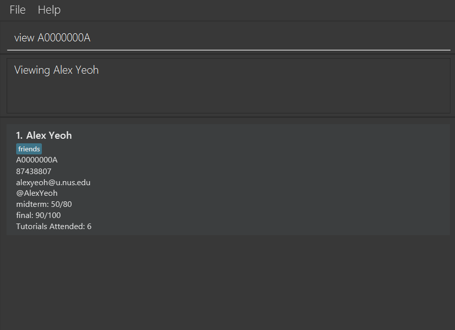
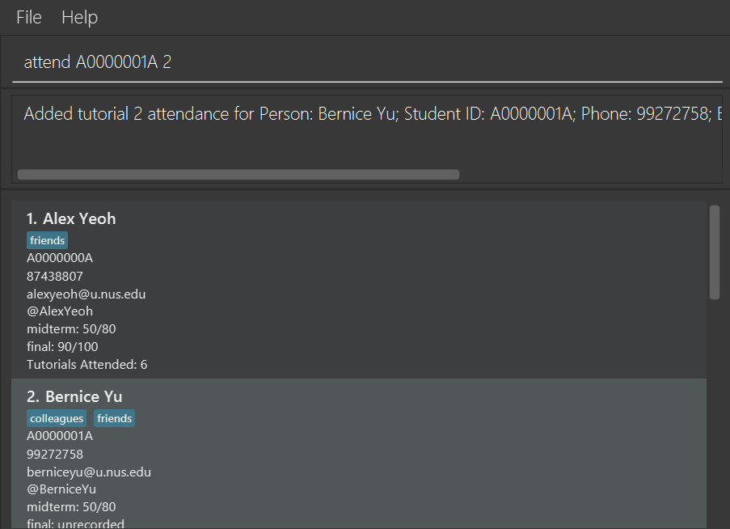
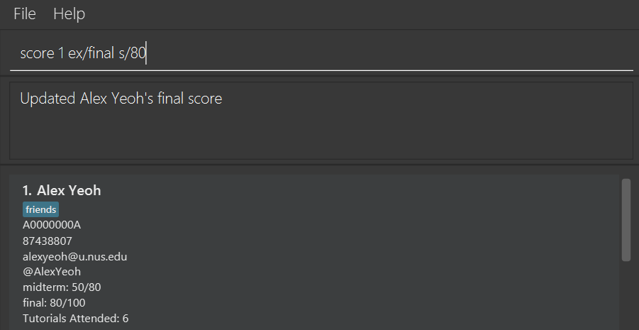

AddressBook Level 3 (AB3) is a **desktop app for managing contacts, optimized for use via a Command Line Interface** (CLI) while still having the benefits of a Graphical User Interface (GUI). If you can type fast, AB3 can get your contact management tasks done faster than traditional GUI apps.

* Table of Contents
{:toc}

--------------------------------------------------------------------------------------------------------------------

## Quick start

1. Ensure you have Java `17` or above installed in your Computer. 
   **Mac users:** Ensure you have the precise JDK version prescribed [here](https://se-education.org/guides/tutorials/javaInstallationMac.html).

1. Download the latest `.jar` file from [here](https://github.com/se-edu/addressbook-level3/releases).

1. Copy the file to the folder you want to use as the _home folder_ for your AddressBook.

1. Open a command terminal, `cd` into the folder you put the jar file in, and use the `java -jar addressbook.jar` command to run the application. 
   A GUI similar to the below should appear in a few seconds. Note how the app contains some sample data. 
   

1. Type the command in the command box and press Enter to execute it. e.g. typing **`help`** and pressing Enter will open the help window. 
   Some example commands you can try:

   * `list` : Lists all contacts.

   * `add n/John Doe p/98765432 e/johnd@example.com a/John street, block 123, #01-01` : Adds a contact named `John Doe` to the Address Book.

   * `delete 3` : Deletes the 3rd contact shown in the current list.

   * `clear` : Deletes all contacts.

   * `exit` : Exits the app.

1. Refer to the [Features](#features) below for details of each command.

--------------------------------------------------------------------------------------------------------------------

## Features

**:information_source: Notes about the command format:** 

* Words in `UPPER_CASE` are the parameters to be supplied by the user. 
  e.g. in `add n/NAME`, `NAME` is a parameter which can be used as `add n/John Doe`.

* Items in square brackets are optional. 
  e.g `n/NAME [t/TAG]` can be used as `n/John Doe t/friend` or as `n/John Doe`.

* Items with `…`​ after them can be used multiple times including zero times. 
  e.g. `[t/TAG]…​` can be used as ` ` (i.e. 0 times), `t/friend`, `t/friend t/family` etc.

* Parameters can be in any order. 
  e.g. if the command specifies `n/NAME p/PHONE_NUMBER`, `p/PHONE_NUMBER n/NAME` is also acceptable.

* Extraneous parameters for commands that do not take in parameters (such as `help`, `list`, `exit` and `clear`) will be ignored. 
  e.g. if the command specifies `help 123`, it will be interpreted as `help`.

* If you are using a PDF version of this document, be careful when copying and pasting commands that span multiple lines as space characters surrounding line-breaks may be omitted when copied over to the application.

* All formats accept multiple spaces in between parameters. e.g. `score  1   ex/   midterm  s/50` will be interpreted as `score 1 ex/midterm s/50`

* `SID` refers to the Student ID.

### Viewing help : `help`

Shows a message explaining how to access the help page.

Format: `help`

### Adding a person: `add`

Adds a person to the address book.

Format: `add n/NAME p/PHONE_NUMBER e/EMAIL a/ADDRESS [t/TAG]…​`

:bulb: **Tip:**
A person can have any number of tags (including 0)

Examples:
* `add n/John Doe p/98765432 e/johnd@example.com a/John street, block 123, #01-01`
* `add n/Betsy Crowe t/friend e/betsycrowe@example.com a/Newgate Prison p/1234567 t/criminal`

### Listing all persons : `list`

Shows a list of all persons in the address book.

Format: `list`

### Editing a person : `edit`

Edits an existing person in the address book.

Format: `edit INDEX [n/NAME] [p/PHONE] [e/EMAIL] [a/ADDRESS] [t/TAG]…​`

* Edits the person at the specified `INDEX`. The index refers to the index number shown in the displayed person list. The index **must be a positive integer** 1, 2, 3, …​
* At least one of the optional fields must be provided.
* Existing values will be updated to the input values.
* When editing tags, the existing tags of the person will be removed i.e adding of tags is not cumulative.
* You can remove all the person’s tags by typing `t/` without
    specifying any tags after it.

Examples:
*  `edit 1 p/91234567 e/johndoe@example.com` Edits the phone number and email address of the 1st person to be `91234567` and `johndoe@example.com` respectively.
*  `edit 2 n/Betsy Crower t/` Edits the name of the 2nd person to be `Betsy Crower` and clears all existing tags.

### Locating persons by name: `find`

Finds persons whose names contain any of the given keywords.

Format: `find KEYWORD [MORE_KEYWORDS]`

* The search is case-insensitive. e.g `hans` will match `Hans`
* The order of the keywords does not matter. e.g. `Hans Bo` will match `Bo Hans`
* Only the name is searched.
* Only full words will be matched e.g. `Han` will not match `Hans`
* Persons matching at least one keyword will be returned (i.e. `OR` search).
  e.g. `Hans Bo` will return `Hans Gruber`, `Bo Yang`

Examples:
* `find John` returns `john` and `John Doe`
* `find alex david` returns `Alex Yeoh`, `David Li` 
  

### Deleting a person : `delete`

Deletes the specified person from the address book.

Format: `delete INDEX`

* Deletes the person at the specified `INDEX`.
* The index refers to the index number shown in the displayed person list.
* The index **must be a positive integer** 1, 2, 3, …​

Examples:
* `list` followed by `delete 2` deletes the 2nd person in the address book.
* `find Betsy` followed by `delete 1` deletes the 1st person in the results of the `find` command.

### Viewing a person: `view`

Finds and displays the specified person from the address book.

Format: `view INDEX` or `view SID`

* Finds the person at the specified `INDEX` or with the given `SID` and displays their information.
* The index refers to the index number shown in the displayed person list.
* The index **must be a positive integer** 1, 2, 3, …​
* The SID must be 9-characters long, in the format A#######X where X is a digit (0-9) and X is a letter (A-Z). The first letter must be 'A'. The letters can be in uppercase or lowercase.
  e.g. a0000000B

Examples:
* `view 2` displays the 2nd person in the address book.
  
* `view A0000000A` displays the person with SID A0000000A.
  

### Marking the attendance for a person: `attend`

Adds the attendance for the specified tutorial, for the specified person from the address book. If attendance for the specified tutorial has already been taken, attendance for that tutorial will be removed instead.

Format: `attend INDEX TUTORIAL` or `attend SID TUTORIAL`

* Adds the attendance for the specified `TUTORIAL`, for the person at the specified `INDEX` or with the given `SID`.
* The index refers to the index number shown in the displayed person list.
* The index **must be a positive integer** 1, 2, 3, …​
* The SID **must be 9-characters long**, in the format A#######X where X is a digit (0-9) and X is a letter (A-Z). The first letter **must be 'A'**. The letters can be in uppercase or lowercase.
  e.g. a0000000B
* The tutorial refers to the tutorial number. It **must be within the number of tutorials in the address book**, and **must be a positive integer** 1, 2, 3, …​

Examples:
* `attend 1 6` adds attendance for tutorial `6` for the 1st person in the address book.
  
* `attend A0000001A 2` adds attendance for tutorial `2` for the person with SID `A0000001A`.
  
* `attend 1 6` removes the attendance for tutorial `6` for the 1st person in the address book if attendance has already been taken for this tutorial and this person.
  

### Adding a score for an exam for a person: `score`

Adds the specified score for the specified exam for the specified person from the address book. If a score already exists, it is overwritten by the most recent valid score command and the score is updated.

Format: `score INDEX ex/EXAM s/SCORE` or `score SID ex/EXAM s/SCORE`

* Adds the specified score `SCORE` for the specified exam `EXAM`, for the person at the specified `INDEX` or with the given `SID`.
* The index refers to the index number shown in the displayed person list.
* The index **must be a positive integer** 1, 2, 3, …​
* The SID **must be 9-characters long**, in the format A#######X where X is a digit (0-9) and X is a letter (A-Z). The first letter **must be 'A'**. The letters can be in uppercase or lowercase.
  e.g. a0000000B
* The score refers to the score attained by the specified person for the specified exam.
* The score **must be a non-negative integer**,  and **not more than the max score** of the specified exam.
* The exam refers to the exam name, and it **must match the exams recorded in the address book exactly**. e.g. If the exam name in the address book is "midterm", the specified exam name must be "midterm" and not "MIDTERM" or "mid term".

Examples:
* `score 1 ex/final s/80` sets the score of the 1st person in the address book to `80`, for the exam `final`.
  
* `score A0000001A ex/midterm s/70` sets the score of the person with SID `A0000001A` in the address book to `70`, for the exam `midterm`.
  

### Editing the max score of an exam: `maxscore`

Changes the max score of the specified exam to the specified max score. It overwrites the pre-existing max score.

Format: `maxscore INDEX ex/EXAM ms/MAXSCORE` or `maxscore SID ex/EXAM ms/MAXSCORE`

* Changes the max score of the specified exam `EXAM` to the specified max score `MAXSCORE`.
* The max score **must be a non-negative integer**, and it **must be more than or equal to any recorded score** for the specified exam. e.g. If a person has score 70/80 for the exam, the new max score must be at least 70.
* The exam refers to the exam name, and it **must match the exams recorded in the address book exactly**. e.g. If the exam name in the address book is "midterm", the specified exam name must be "midterm" and not "MIDTERM" or "mid term".

Examples:
* `maxscore ex/midterm ms/90` changes the max score of the exam `midterm` to `90`.
  

### Sorting the list : `sort`

Sorts the list based on a parameter.
The list can currently be sorted by ascending order of name using parameter `n/`.
It will support sorting of grades by Version 1.3 or earlier using parameter `g/`.

Format: `sort PARAMETER`

Examples:
* `sort n/` sorts in ascending order of names.
* `sort g/` sorts in ascending order of names.

### Clearing all entries : `clear`

Clears all entries from the address book.

Format: `clear`

### Exiting the program : `exit`

Exits the program.

Format: `exit`

### Saving the data

AddressBook data are saved in the hard disk automatically after any command that changes the data. There is no need to save manually.

### Editing the data file

AddressBook data are saved automatically as a JSON file `[JAR file location]/data/addressbook.json`. Advanced users are welcome to update data directly by editing that data file.

:exclamation: **Caution:**
If your changes to the data file makes its format invalid, AddressBook will discard all data and start with an empty data file at the next run. Hence, it is recommended to take a backup of the file before editing it. 
Furthermore, certain edits can cause the AddressBook to behave in unexpected ways (e.g., if a value entered is outside of the acceptable range). Therefore, edit the data file only if you are confident that you can update it correctly.

### Archiving data files `[coming in v2.0]`

_Details coming soon ..._

--------------------------------------------------------------------------------------------------------------------

## FAQ

**Q**: How do I transfer my data to another Computer? 
**A**: Install the app in the other computer and overwrite the empty data file it creates with the file that contains the data of your previous AddressBook home folder.

--------------------------------------------------------------------------------------------------------------------

## Known issues

1. **When using multiple screens**, if you move the application to a secondary screen, and later switch to using only the primary screen, the GUI will open off-screen. The remedy is to delete the `preferences.json` file created by the application before running the application again.
2. **If you minimize the Help Window** and then run the `help` command (or use the `Help` menu, or the keyboard shortcut `F1`) again, the original Help Window will remain minimized, and no new Help Window will appear. The remedy is to manually restore the minimized Help Window.

--------------------------------------------------------------------------------------------------------------------

## Command summary

Action | Format, Examples
--------|------------------
**Add** | `add n/NAME p/PHONE_NUMBER e/EMAIL a/ADDRESS [t/TAG]…​`   e.g., `add n/James Ho p/22224444 e/jamesho@example.com a/123, Clementi Rd, 1234665 t/friend t/colleague`
**Clear** | `clear`
**Delete** | `delete INDEX`  e.g., `delete 3`
**View** | `view INDEX`, `view SID`   e.g. `view 2`, `view A0000000A`
**Attend** | `attend INDEX TUTORIAL`, `attend SID TUTORIAL`   e.g. `attend 1 6`, `attend A0000000A 4`
**Score** | `score INDEX ex/EXAM s/SCORE`, `score SID ex/EXAM s/SCORE`   e.g. `score 2 ex/midterm s/60`, `score A0000000A ex/final s/80`
**Maxscore** | `maxscore ex/EXAM ms/SCORE`   e.g. `maxscore ex/midterm ms/90`
**Edit** | `edit INDEX [n/NAME] [p/PHONE_NUMBER] [e/EMAIL] [a/ADDRESS] [t/TAG]…​`  e.g.,`edit 2 n/James Lee e/jameslee@example.com`
**Find** | `find KEYWORD [MORE_KEYWORDS]`  e.g., `find James Jake`
**List** | `list`
**Help** | `help`
